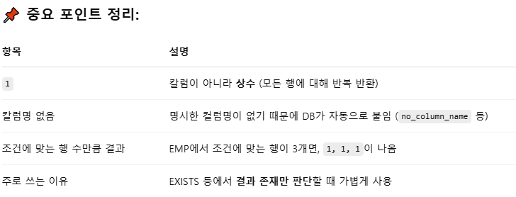

# 정보처리기사는 SQL 표준 규격을 따름
> 그렇다면 식별자(테이블, 칼럼, 뷰, 인덱스 등 )에 다 큰따옴표를 적용해야함??

<h2>식별자에 큰따옴표를 생략해도 된다.</h2>

**<h2>SQL 표준에서는 "로 식별자를 감쌀 수 있도록 정의되어 있지만,일반적인 경우(공백 없음, 예약어 아님)에는 큰따옴표 없이도 전혀 문제 없이 작동하기 때문</h2>**

예시로 아래  두 쿼리는 동일하게 작동함 

```
-- 큰따옴표 없는 경우 (자주 쓰는 형태)
SELECT 이름, 부서 FROM 직원;

-- 큰따옴표 있는 경우 (표준에 맞춰 명확하게 표현)
SELECT "이름", "부서" FROM "직원";


```

<h2>꼭 필요한 경우는 언제???</h2>



